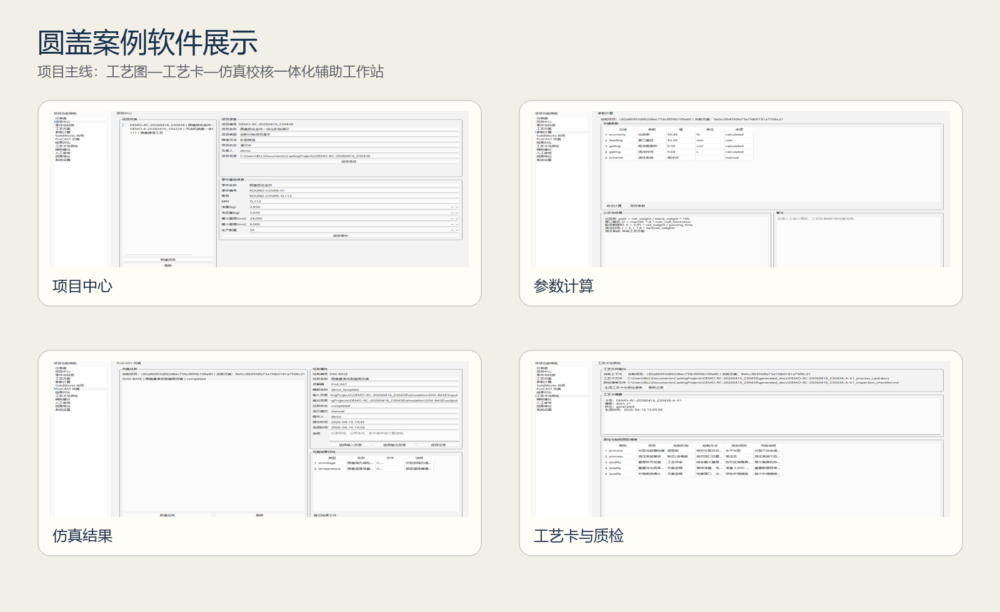
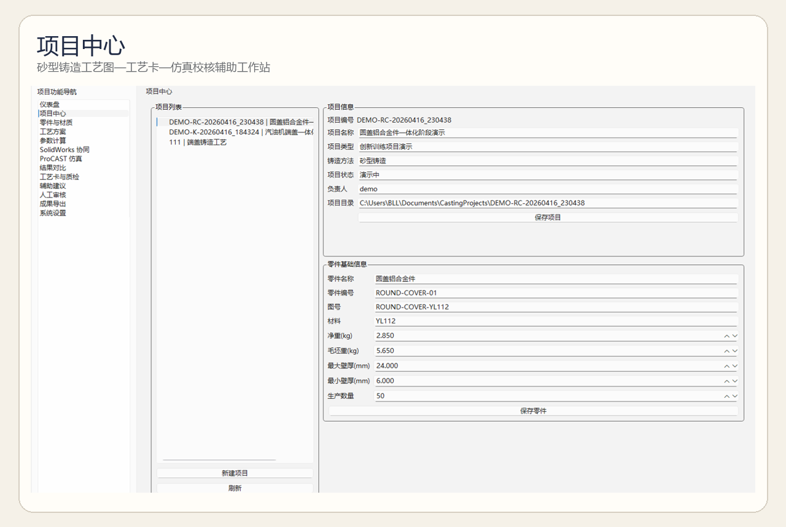
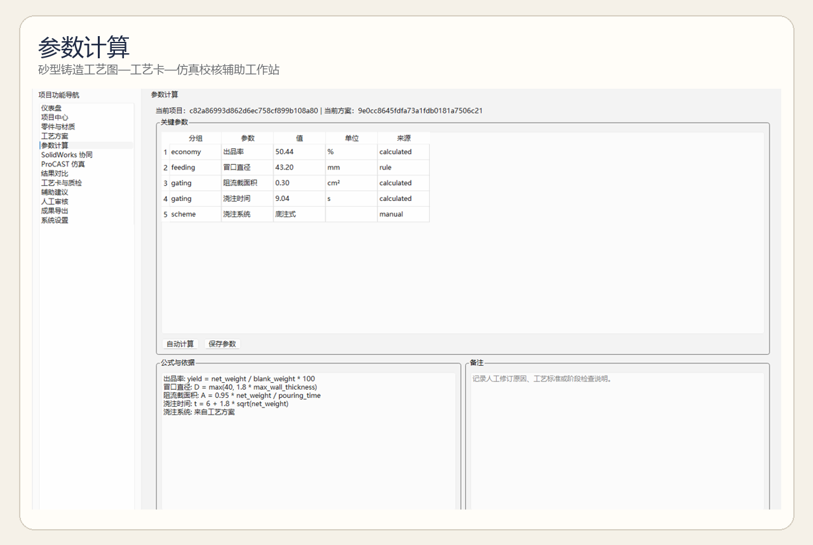
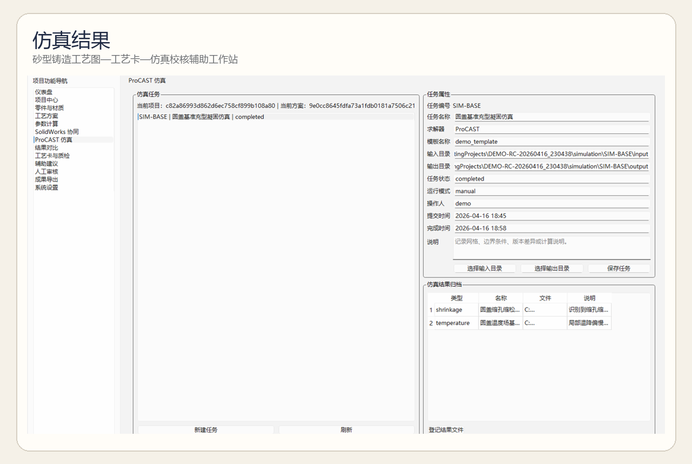
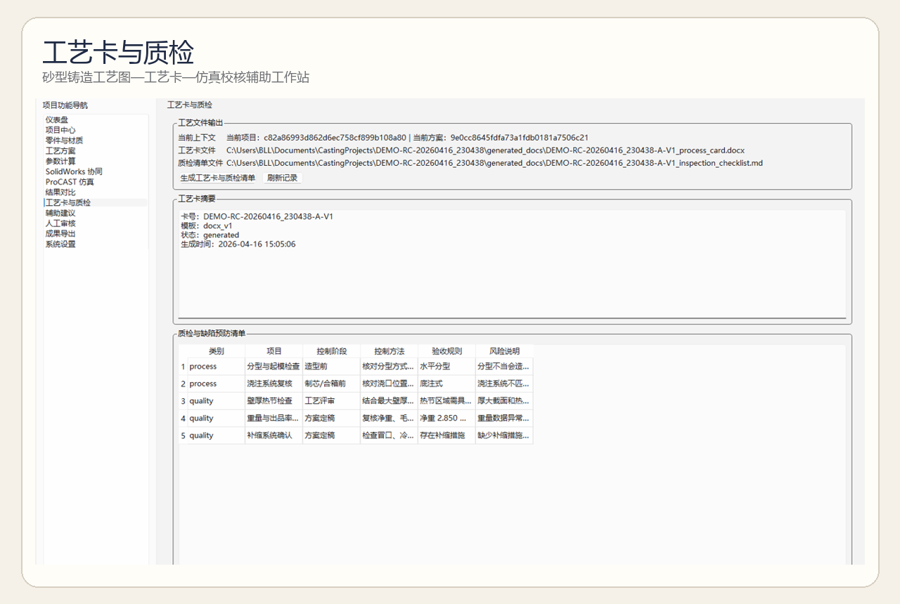
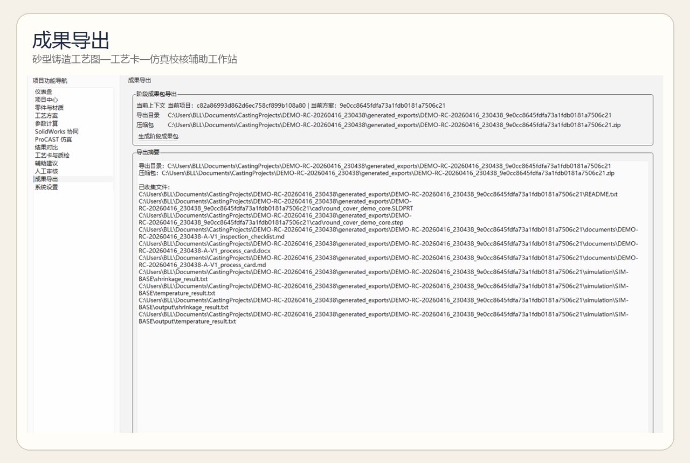

# 砂型铸造工艺图—工艺卡—仿真校核辅助工作站

一个面向大学生创新训练项目的本地桌面辅助原型，用于把**典型砂型铸造件的工艺设计、仿真归档、工艺卡生成与阶段成果导出**组织到同一项目上下文中。

当前对应的项目主线为：

> 砂型铸造工艺图与工艺卡的一体化建模及仿真辅助优化

软件当前定位不是独立商业产品，而是：

- 面向创新训练项目的辅助展示与归档工具
- 服务“工艺图—工艺卡—仿真校核”闭环的轻量化工作站原型
- 用于典型件案例管理、仿真结果整理、质检清单输出和成果包导出



---

## 项目对应关系

本工作站当前主要服务以下 4 类任务：

1. 项目与零件基础信息管理  
2. 工艺方案、参数计算与 CAD/CAE 文件归档  
3. ProCAST 仿真结果整理与风险识别辅助记录  
4. 工艺卡、缺陷预防/质检清单及阶段成果包导出  

对应创新训练项目的阶段成果表达为：

- 三维工艺建模成果归档
- 仿真结果与风险区域记录
- 工艺卡与质检清单输出
- 阶段成果包整理

---

## 当前功能范围

- SQLite 本地数据库初始化与数据存储
- PySide6 桌面程序
- 项目中心、零件与材质、工艺方案、参数计算页面
- SolidWorks 文件关联与导出记录
- ProCAST 仿真任务与结果登记
- 工艺卡、质检清单与成果包导出
- 辅助建议生成与人工审核页面
- 本地配置与环境检查

---

## 核心流程

```text
项目建档
  -> 零件与材料信息录入
  -> 工艺方案定义
  -> 参数计算与校核
  -> CAD / ProCAST 文件归档
  -> 工艺卡与质检清单生成
  -> 阶段成果包导出
```

---

## 当前演示案例

当前仓库已切换到与项目展示材料一致的演示主线：

- 演示项目：`圆盖铝合金件一体化阶段演示`
- 演示零件：`圆盖铝合金件`
- 方案名称：`圆盖基准工艺方案`
- 导出成果：工艺卡、缺陷预防/质检清单、阶段成果包

演示索引文件：

- [`artifacts/demo_case.json`](artifacts/demo_case.json)
- [`artifacts/demo_workflow_summary.json`](artifacts/demo_workflow_summary.json)
- [`artifacts/demo_workflow_summary.md`](artifacts/demo_workflow_summary.md)

说明：

- 当前演示案例的**项目名称、零件名称、文档与成果包口径**已经与项目主线统一。
- 现有 CAD 几何示例仍复用仓库中已有样例模型，仅作为软件流程演示载体。

---

## 界面预览

### 1. 项目中心

用于维护项目编号、零件编号、材料、壁厚和生产数量等基础信息。  
默认演示项目已切换为圆盖铝合金件案例。



### 2. 参数计算

用于组织关键工艺参数、公式依据和人工修订说明，便于项目汇报时展示“参数不是拍脑袋给出的”。



### 3. ProCAST 仿真与结果整理

用于挂接仿真任务、浏览仿真结果摘要，并将结果记录纳入项目上下文。



### 4. 工艺卡与质检清单

可直接生成阶段工艺卡和缺陷预防/质检清单，支撑“仿真结果向工艺文件转化”的项目亮点。



### 5. 成果包导出

支持将文档、CAD 文件、仿真输入输出和说明文件整理为统一成果包，便于项目展示和后续归档。



---

## 展示资产

为了同时服务 GitHub 展示和项目汇报 PPT，本仓库额外生成了两套图片资产：

- `artifacts/showcase/readme/`：带标题和留白的 README 展示图
- `artifacts/showcase/ppt/`：16:9 裁剪后的 PPT 直接可用图

---

## 运行方式

```powershell
cd E:\zhuzaochuangxin\casting_workstation
pip install -e .
casting-workstation
```

若需要刷新演示数据：

```powershell
python .\scripts\prepare_demo_case.py
python .\scripts\run_demo_workflow.py
```

若需要重新生成 README 中的界面截图：

```powershell
python .\scripts\capture_walkthrough_screenshots.py
```

---

## 数据与默认目录

- 数据库：`%APPDATA%\CastingWorkstation\casting_workstation.db`
- 项目目录：`%USERPROFILE%\Documents\CastingProjects`

说明：

- 默认目录名称沿用开发阶段命名，以避免影响已有本地数据。
- 对外展示时，建议统一称其为“砂型铸造工艺图—工艺卡—仿真校核辅助工作站”。

---

## SolidWorks 桥接

桥接项目位于：

- `bridge/solidworks-bridge/`

构建要求：

- `.NET SDK 8`
- 本地 `SolidWorks` 环境，用于真实导出操作

---

## Windows 打包

```powershell
cd E:\zhuzaochuangxin\casting_workstation
powershell -ExecutionPolicy Bypass -File .\build\windows\build.ps1 -Clean
```

若安装了 `Inno Setup 6`，脚本会额外生成：

- `release\installer\CastingWorkstationSetup.exe`

若未安装 `Inno Setup`，仍会生成：

- `release\app\CastingWorkstation\`
- `release\app\SolidWorksBridge\`

---

## 当前适用边界

本原型当前适合：

- 创新训练项目过程展示
- 教学案例整理
- 典型件工艺资料归档
- 阶段性成果打包

当前不定位为：

- 实际生产线控制系统
- 自动闭环决策平台
- 完整工业级铸造 MES/PLM 系统
